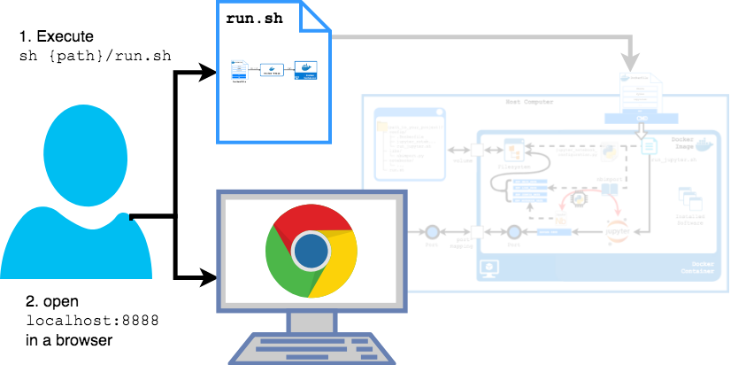

# socialnetworks

The following picture shows the JupyterLab configuration in action. **Use** it with three simple steps:

1. Download and run docker 'https://www.docker.com/products/docker-desktop'
2. Execute `sh {path_to_your_project}/run.sh`
3. Open `localhost:8888` from a browser

<table class="image">
<tr><td></td></tr>
<tr><td class="caption" >Using the JupyterLab configuration</td></tr>
</table>
